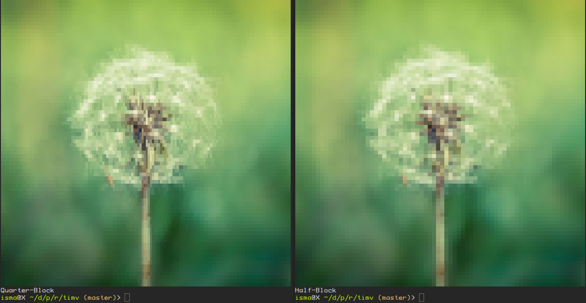

# timv

Terminal image viewer written in Rust.

Displays images in the terminal in true color using "block element" characters.
While other similar programs use upper/lower half block characters (▀ ▄),
`timv` (by default) uses quarter blocks (▘ ▝ ▖ ▗ ▀ ▌ ▚). This allows for a
greater resolution (4 pixels per character instead of only 2). Half- and
full-block rendering is also available with the `-b 2` and `-b 1` options.

## Usage

Display an image

```sh
timv IMAGE
```

Specify your terminal font's width/height ratio to avoid images being squished.
E.g for a font that's 9 by 16 pixels, specify 9/16 = 0.5625

```sh
timv -r 0.5625 IMAGE
```

Display image on at most 20 lines
```sh
timv -h 20 IMAGE
```

Display image using half-block characters
```sh
timv -b 2 IMAGE
```

Display image using full-block characters
```sh
timv -b 4 IMAGE
```

## Examples

### Original


### Result


### Quarter-Block vs Half-Block

